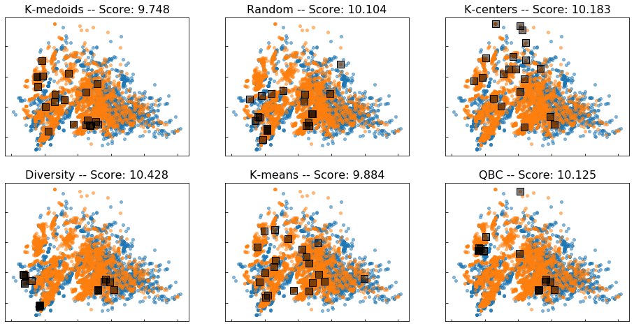
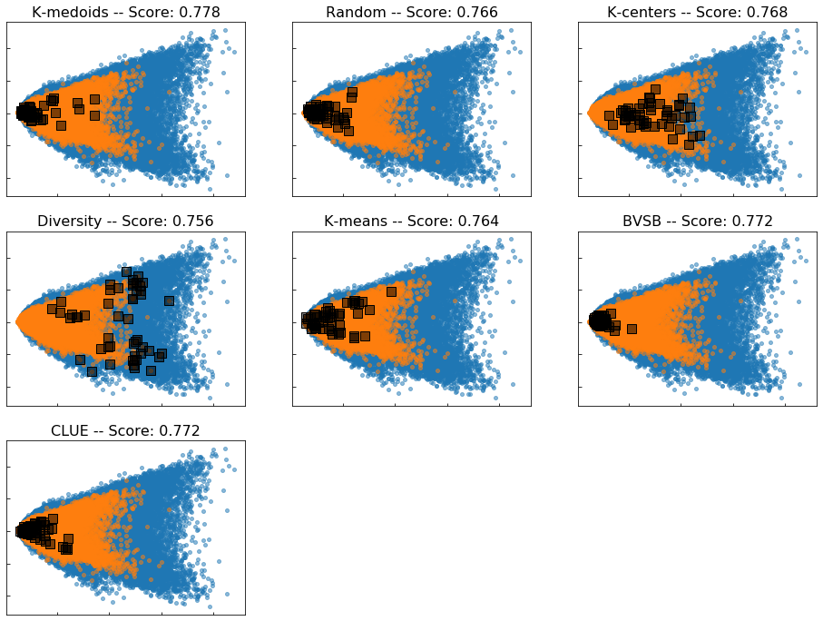

# Discrepancy-Based Active Learning for Domain Adaptation

## Requirements

The following packages are required to run the experiments:
- `tensorflow` (>= 2.0)
- `scikit-learn`
- `numpy`
- `pandas`
- `Pillow`
- `matplotlib` (for visualization)

Besides, the [`adapt`](https://github.com/antoinedemathelin/adapt) package has been used for TrAdaBoost and DANN


## Example

A simple example is provided in `notebooks/Toy_example`. It presents an application of the K-medoids algorithm on the following toy domain adaptation problem:

```python
from utils import toy_example

np.random.seed(2)
Xs, Xt, f = toy_example()
ys = f(Xs)
yt = f(Xt)
```


A model fitted on source labeled data already returns reasonable predictions on the target domain but can be improved with additional target labels.

```python
from sklearn.neural_network import MLPRegressor
from sklearn.metrics import mean_absolute_error

np.random.seed(0)
model = MLPRegressor()
model.fit(Xs, ys)
y_pred = model.predict(X)
score = mean_absolute_error(yt, model.predict(Xt))
print("Target MAE = %.3f"%score)

>>> Target MAE = 0.122
```


Given a budget of 10 queries, the labels selection can be optimized using the K-medoids algorithm:

```python
from query_methods import KMedoidsQuery

np.random.seed(0)
kmedoids = KMedoidsQuery()
kmedoids.fit(Xt, Xs, ys, 10)
queries = kmedoids.predict(10)

np.random.seed(0)
model = MLPRegressor()
model.fit(np.concatenate((Xs, Xt[queries])), np.concatenate((ys, yt[queries])))
y_pred = model.predict(X)
score = mean_absolute_error(yt, model.predict(Xt))
print("Target MAE = %.3f"%score)

>>> Target MAE = 0.077
```


## Experiments

The experiments are conducted on three benchmark datasets:
- Superconductivity [UCI](https://archive.ics.uci.edu/ml/datasets/superconductivty+data#)
- Office [Berkeley](https://people.eecs.berkeley.edu/~jhoffman/domainadapt/#datasets_code)
- Digits [SYNTH](http://yaroslav.ganin.net/),  [SVHN](http://ufldl.stanford.edu/housenumbers/)

Experiments can be run with the following command lines:

```
cd dbal
python run_experiments.py
```

## Notebooks

Quick results can be obtained in the `notebooks` folder:

### Superconductivity 

[](https://github.com/AnonymousAccount0/dbal/blob/master/notebooks/Superconductivity.ipynb)

### Office

[](https://github.com/AnonymousAccount0/dbal/blob/master/notebooks/Office.ipynb)

### Digits

[](https://github.com/AnonymousAccount0/dbal/blob/master/notebooks/Digits.ipynb)

